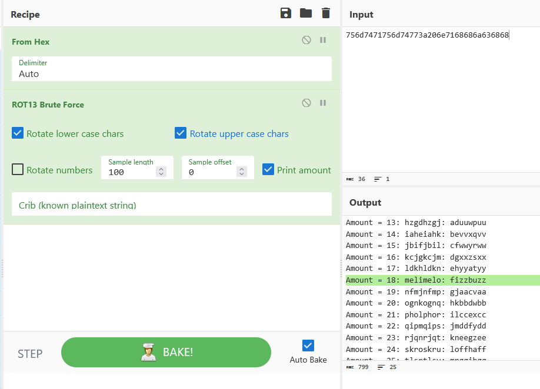

Le message encodé en hexadécimal à été récupéré dans Wireshark encore une fois, puis brute force dans Cyberchef. A noter que les algorithmes de déchiffrement seront fait plus tard dans la chronologie du projet, et que Cyberchef est la solution en attendant.
On le retrouve au cran 18, ou 26-8.

