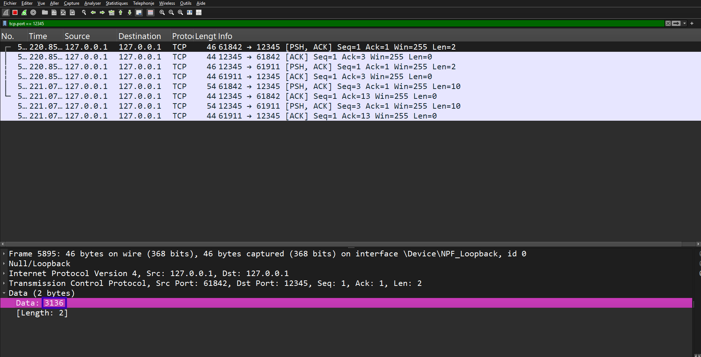

Pour effectuer une attaque Man-in-the-Middle sur notre application, nous devons nous possitionner en temps qu'attaquant. 

Sachant que notre application ne passe pas par la carte réseau et reste en local:host12345, nous pouvons utiliser tout simplement Wireshark, en le plaçant en mode loopback (mode permettant d'analyser les flux ne passant pas par la carte réseau) avec le filtre suivant : tcp.port == 12345

Nous nous sommes placés comme attaquant dans toutes les différentes possibilitées que nous avons crées, et nous avons pris des screenshots de ce qui a pu être récupéré.

Une fois les documents récupéré, un utilisateur malveillant peut se servir notamment de Cyberchef afin de décrypter le message (screenshots également à l'appui) :

CAESAR :  
VIGENERE :   
AES :  
RSA :  

Dépendant de la force du chiffrement et de la sécurisation, il se peut que l'utilisateur malveillant récupère quelque chose qui ne puisse pas être déchiffré, notamment dans le cas d'un hash ou d'un chiffrement AES ou clé asymétrique. 