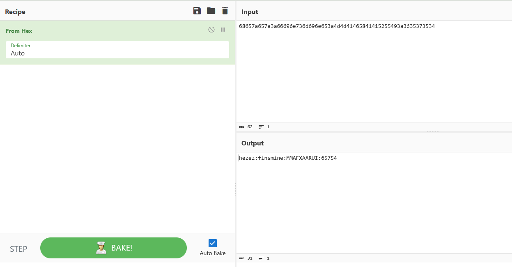

Cette version du code avait pour objectif d'avoir un moyen de chiffrer les clés, en plus de faire du chiffrement et caesar et Vigénère sur le message et le peusdonyme.

Cela a notamment été implémenté via les fonctions de caesar_cipher.py
Ensuite une enquête à été conduite avec Wireshark : 

